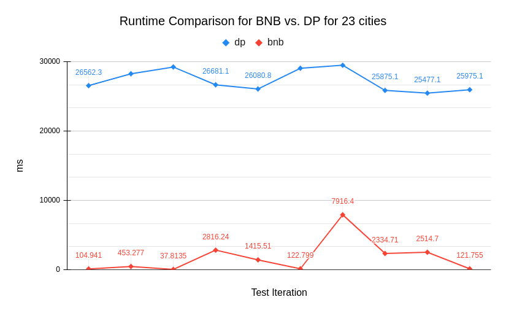
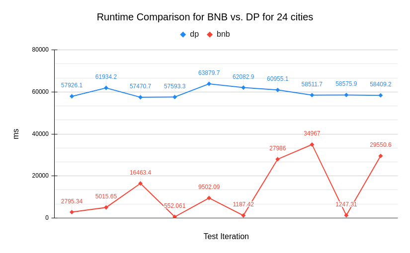
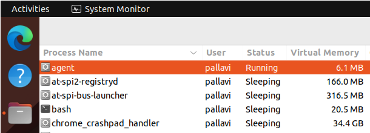
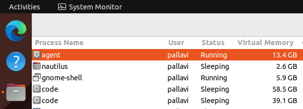

# Solutions for Travelling Salesman Problem
## Problem Statement
Traveling salesman's problem is to find the optimal path for visiting the given locations and their distances. The optimal path is the path with minimum cost. The salesman comes back to the city from where he started the path. For this project, I have following assumptions:
   1. Each city is connected to every other city.
   2. Distance or cost of going from one city to another is the same as coming back from that city to the initial city i.e., the cost of going from city A to B is the same as going from city B to city A.

For the solution, I am using three algorithms:
1. Branch and Bound Depth First Search algorithm
      - This algorithm performs exhaustive search on the given cities, and finds the optimal path. The algorithm selects a starting city and iterates over other cities using DFS technique and an initial best cost is provided to the algorithm. In each iteration it moves to the city only if adding it to the path does not increase the given cost. If it does, that city is not included in the current path and the path if that city was included is pruned meaning is ignored and not processed. If a path with less cost is found then the best cost is updated to this value. 
2. Simulated Annealing Stochastic Local Search
      - This algorithm creates a random path initially and then swaps two cities at a time to get an optimal path. Each time a path is found, its cost is compared with the previously found path. If the cost is reduced, then that path is kept and used in later iterations for cost comparison.
3. Dynamic Programming based naive approach
      - In this approach, an intial city is chosen and then next city with mininum cost is added to the path, and then next city with minimum cost is chosen and so on.

## Observations and Results

### Bnb (Anytime Property)
If ran to completion (without any time limits), bnb finds the optimal path. On finding one solution, the algorithm does not stop. It keeps running the exhaustive search to find a path with lower cost. Main point to notice is that if the algorithm can find the optimal path in between, it will still keep searching to prove optimality as shown in the graph below. Here, the algorithm found the optimal solution in 5 seconds but finished in 2 minutes after searching through the entire tree, meaning expanding all possible paths.
The below graph is a snapshot of running the algorithm on an input with 30 cities. The algorithm calculates the optimal path for 30 cities in around 120 seconds and then spends rest of the time proving that this is optimal path by searching for a lower path.


### SLS (Sub-optimal Results)
The Simulated Annealing algorithm, deviates from the optimal path in some cases and returns the sub-optimal path as depicted in the graph below. The graph represents the comparison of the BnB algorithm with the Simulated Annealing algorithm for the same inputs. The reason is the randomness and no exhaustive search. The benefit is that it returns the good sub-optimal solution in very little time as compared to the time taken by the BnB algorithm for getting the optimal path.


### Dynamic Programming (Naive) Solution
If ran to completion (without any time limits), this approach finds the optimal path. This apporach works good for smaller problems where number of cities is less than 24 cities. Although, it takes huge amount of memory as compared to other approaches.

### Branch and Bound Algorithm (bnb) vs Dynmaic Programming (dp) Solution

For larger problem sizes where number of cities >= 25, bnb performs much better than dp and takes significantly less amout of space.

Below graphs shows the **runtime comparison** of bnb and dp solution with 23 and 24 cities.






Below images show the huge difference in **memory consumption** by these solutions. Please note that `agent` is the application name for this solution in both the screenshots.

**Bnb**



**DP**



## Instructions to Build code
1. goto Travelling-Salesman-Problem folder using command:
   ```
   cd Travelling-Salesman-Problem
   ```
2. run make command: 
   ```
   make
   ```
   This make command will create an executable called `agent`


## Instructions to Execute code for 1 file

1. The agent take 2 parameters:
1. parameter 1 : bnb OR sls OR dp
            - bnb - runs BnB DFS algorithm
            - sls - runs Simulated Annealing SLS algorithm
            - dp - runs Dynamic programming algorithm

- For Example:
   ```
   ./agent bnb tests/tsp-problem-25-6-100-5-1.txt
   ./agent sls tests/tsp-problem-25-6-100-5-1.txt
   ./agent dp tests/tsp-problem-25-6-100-5-1.txt
  ```

All programs prints the last result only.

Output Format:
   1. BnB: file_path, timeout, time taken to caluclate result in ms, cost, number of expanded nodes, number of pruned nodes, path
   2. SLS: file_path, timeout,  time taken to caluclate result in ms, cost, number of iterations taken
   3. DP: file_path, timeout,  time taken to caluclate result in ms, cost
    
NOTE: if program did not timeout, then second column would be empty

## Instructions to Execute code for more than 1 files

1. To run multiple files in one go, just edit the run_tests.sh file accordingly.
2. The script produces csv files with outputs : result_bnb.csv, result_sls.csv
3. For example:
        1. To run both BnB and SLS, no need to modify the file, just run the command:
            chmod +x run_tests.sh
            ./run_tests.sh
        2. To run only BnB algo, comment SLS part inside the script and run it
        3. To run only SLS algo, comment BnB part inside the script and run it

